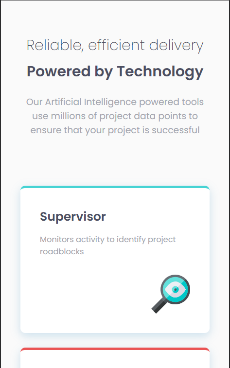
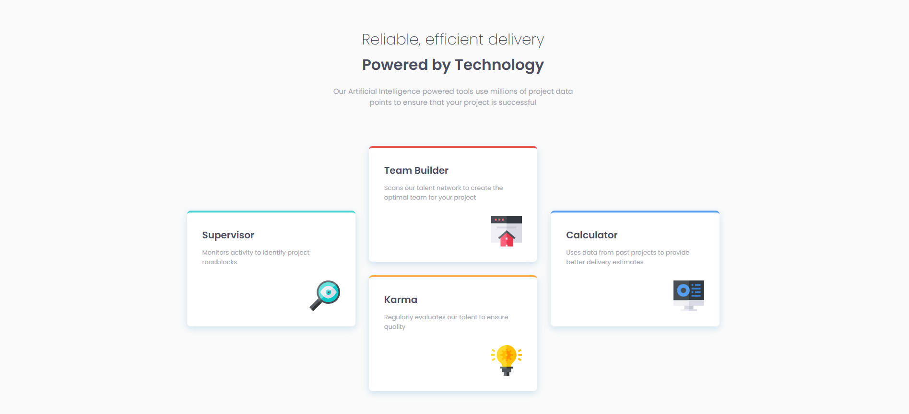
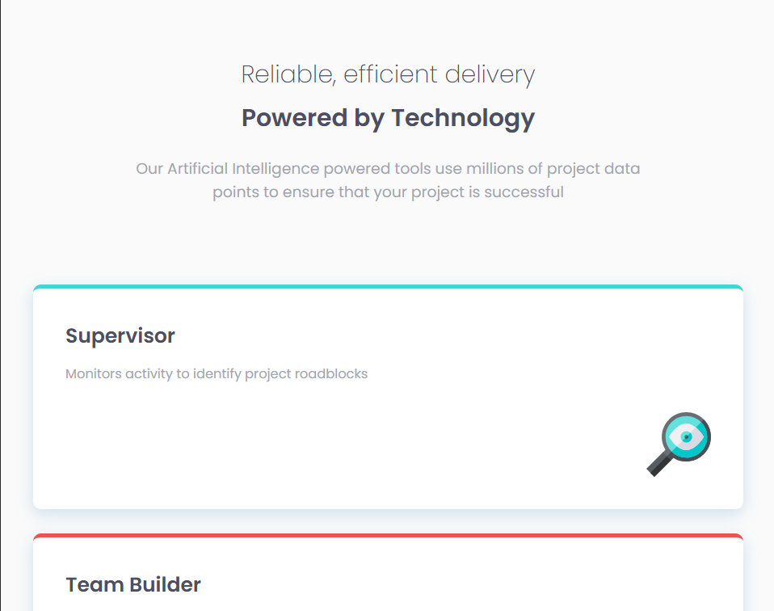

# Frontend Mentor - Four card feature section

## Welcome! 👋

Thanks for checking out this front-end coding challenge.

This is a solution to the [Four card feature section challenge on Frontend Mentor](https://www.frontendmentor.io/challenges/four-card-feature-section-weK1eFYK). Frontend Mentor challenges help me improve my coding skills by building realistic projects. 

## Table of contents

- [Overview](#overview)
  - [The challenge](#the-challenge)
  - [Screenshot](#screenshot)
  - [Links](#links)
- [My process](#my-process)
  - [Built with](#built-with)
  - [What I learned](#what-i-learned)
  - [Continued development](#continued-development)
  - [Useful resources](#useful-resources)
- [Author](#author)
- [Acknowledgments](#acknowledgments)

## Overview

### The challenge

Users should be able to:

- See hover and focus states for all interactive elements on the page

### Screenshot

### Links

- Solution URL: [Four card feature section's Github Page](https://github.com/irsalinalayalia/fe_mentor_four_card_feature_section)
- Live Site URL: [Four card feature section's Live Site](https://irsalinalayalia.github.io/fe_mentor_four_card_feature_section/)

## My process

### Built with
- Mobile-first workflow
- Semantic HTML5 markup
- CSS custom properties
- Flexbox
- Grid

### What I learned

In this project, I implemented CSS Grid for the very first time, and honestly — it was incredibly fun and satisfying to work with. Grid made it super flexible to structure a complex layout while keeping everything clean and easy to manage. It allowed me to precisely position each card and maintain consistency, especially when scaling up to the desktop view.

I also used a mobile-first approach when writing the CSS, and it really paid off. By starting with the smallest screen size and progressively enhancing the layout, I was able to ensure a fully responsive design that looks great on all devices — from mobile phones to large desktop screens.

Highlights:

✅ Mobile-first development: Built the layout starting from mobile, ensuring maximum responsiveness.

✅ First-time use of CSS Grid: Creating the 4-card layout with Grid was efficient, clean, and super enjoyable!

✅ Custom properties (CSS variables): Helped maintain consistent colors, fonts, and spacing throughout the project.

✅ Clean typography: Used the Poppins font family with different weights to reinforce visual hierarchy.

Overall, this project gave me valuable hands-on experience in building a responsive, modern, and well-structured layout using new, powerful techniques.

### Useful resources

- [Jasoneczek's Profile on Front End Mentor](https://www.frontendmentor.io/profile/jasoneczek) - This profile helped me out to know the exact size of the card and padding because my FE Mentor Member is not premium so I dont get the figma file and dont know the exact size and the Jasoneczek's profile helps me alot.

## Author

- Website - [Irsalina Layalia Shabrina](https://irsalinalayalia.vercel.app/)

- Frontend Mentor - [@irsalinalayalia](https://www.frontendmentor.io/profile/irsalinalayalia)

## Acknowledgments

Thanks to God who always help and accompanied me when working on this project
